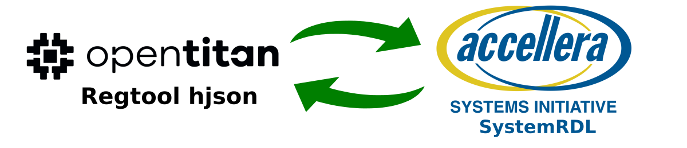

Introduction
============

This package implements OpenTitan regtool hjson  import and export functionality for the PeakRDL
toolchain. This involves the ability to translate between a SystemRDL register
model and `OpenTitan hjson format <https://opentitan.org/book/util/reggen/index.html>`_.

The two formats might not be completelly compatible between each other.
The goal of the project is to ease migration from one format to another and allow reusing the tools from another toolchain.

Installing
----------

Install by cloning the repo first

.. code-block:: bash

    git clone https://github.com/Risto97/PeakRDL-opentitan.git
    cd PeakRDL-opentitan
    pip install -e .

Quick Start
-----------

Exporting to OpenTitan hjson
^^^^^^^^^^^^^^^^^^^^^^^^^^^^
Below is a simple example that shows how to convert a SystemRDL register model
into OpenTitan hjson file for regtool.

.. code-block:: python
    :emphasize-lines: 3, 13-14, 16

    import sys
    from systemrdl import RDLCompiler, RDLCompileError
    from peakrdl_opentitan import OpenTitanExporter, Standard

    rdlc = RDLCompiler()

    try:
        rdlc.compile_file("path/to/my.rdl")
        root = rdlc.elaborate()
    except RDLCompileError:
        sys.exit(1)

    exporter = OpenTitanExporter(
    )

    exporter.export(root, "path/to/output.hjson")

Another option is using PeakRDL CLI `tool <https://github.com/SystemRDL/PeakRDL>`_.

.. code-block:: bash

   peakrdl opentitan <path/to/my.rdl> -o <path/to/output.hjson>

Importing OpenTitan hjson
^^^^^^^^^^^^^^^^^^^^^^^^^
Below is a simple example of how to import an OpenTitan hjson definition into the
register model.

.. code-block:: python
    :emphasize-lines: 3, 6, 9

    import sys
    from systemrdl import RDLCompiler, RDLCompileError
    from peakrdl_opentitan import OpenTitanImporter

    rdlc = RDLCompiler()
    importer = OpenTitanImporter(rdlc)

    try:
        importer.import_file("path/to/opentitan_ip.hjson")
        rdlc.compile_file("path/to/my.rdl")
        root = rdlc.elaborate()
    except RDLCompileError:
        sys.exit(1)

Another option is using PeakRDL CLI `tool <https://github.com/SystemRDL/PeakRDL>`_.
This way the output SystemRDL file will be written instead.

.. code-block:: bash

   peakrdl systemrdl <path/to/input.json> -o <path/to/output.rdl>

Links
-----

- `Source repository <https://github.com/Risto97/PeakRDL-opentitan>`_
- `Release Notes <https://github.com/Risto97/PeakRDL-opentitan/releases>`_
- `Issue tracker <https://github.com/Risto97/PeakRDL-opentitan/issues>`_

.. toctree::
    :hidden:

    self
    importer
    exporter
